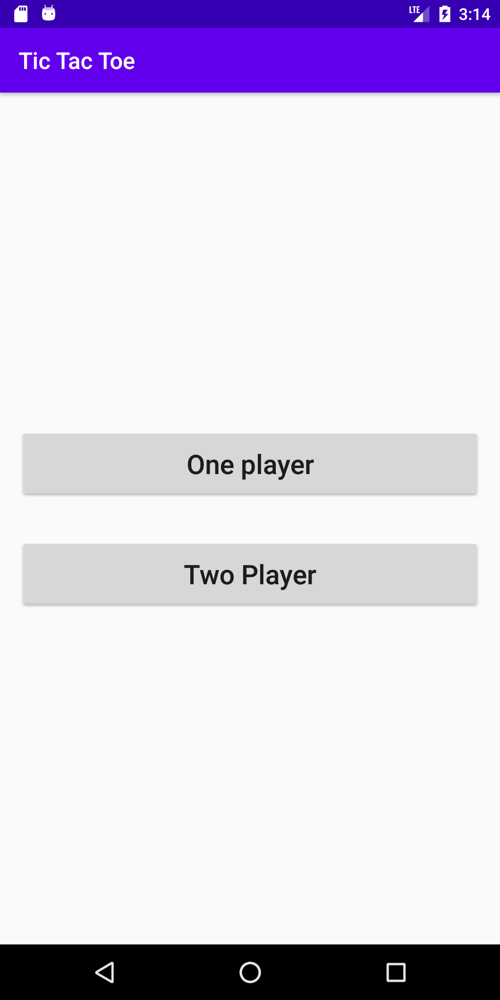
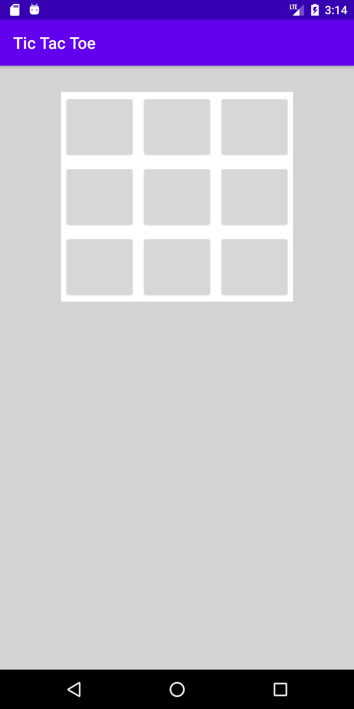
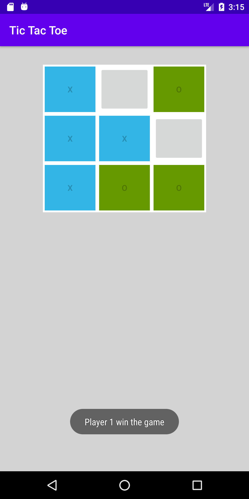

# Tic_Tac_Toe_Game_Kotlin_with_Random_Play
Simple Tic Tac Toe App using Kitlin to play with two player or one player

# Tools

- ConstraintLayout
- LinearLayout
- ArrayList
- TableLayout
- Random class

# Images
     

# Author

Created by Mohamed Sobhy on 2020. Copyright © 2020 Mohamed Sobhy. [LinkedIn](https://www.linkedin.com/in/mohamed-sobhy-040958181/)

# Environment

This project was generated by Android Studio 4.0.0 and Kotlin 

# Further Help

To get more help on the project, you can contact with me by email address m7md.sob7y20@gmail.com

# Note

This project created on 2020, some libraries or code might be depreciated.
